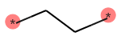
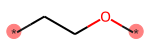
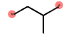

# PSMILES - Fun with P🙂s strings

The `psmiles` Python package contains tools to work with polymer SMILES (PSMILES or P🙂s) strings. PSMILES strings are a chemical language to represent polymers.

⏩ See the [Documentation](https://psmiles.readthedocs.io/)

## PSMILES strings

PSMILES strings are string representations of polymer structures. A PSMILES string has two star (`[*]` or `*`) symbols that indicate the two endpoints of the polymer repeat unit and otherwise follows the daylight SMILES syntax defined at [OpenSmiles](http://opensmiles.org/opensmiles.html). See [PSMILES guide](https://www.polymergenome.org/guide/) for more details.

Examples:

 Polyethylene | Polyethylene oxide | Polypropylene |
|-|-|-|
| `[*]CC[*]` | `[*]CCO[*]` | `[*]CC([*])C` |
|  |  |  |


## How to use `psmiles`


Create an object of the class `PolymerSmiles` for your PSMILES string. The object has functions to compute properties or manipulate the PSMILES string. For example, canonicalize a PSMILES string with

```python
from psmiles import PolymerSmiles as PS

ps = PS("C(c1ccccc1)(C[*])[*]")
ps.canonicalize
```

See the [Documentation](https://psmiles.readthedocs.io/) for more. Also, check out [`test_book.ipynb`](https://github.com/Ramprasad-Group/psmiles/blob/main/tests/test_book.ipynb) for examples.


## Features, functions, and roadmap

- [x] Canonicalize PSMILES strings (via the [canonicalize_psmiles](https://github.com/Ramprasad-Group/canonicalize_psmiles) package)
- [x] Polymer fingerprints (descriptors or features)
    - [x] polyBERT fingerprints (see [polyBERT](https://github.com/Ramprasad-Group/polyBERT) and [arXiv](https://arxiv.org/abs/2209.14803))
    - [x] [Mordred](https://github.com/mordred-descriptor/mordred) fingerprints
    - [x] Circular (Morgen) fingerprints as implemented in RDKit
    - [x] RDKit fingerprints as implemented in RDKit
- [x] Dimerize PSMILES strings
- [x] Randomize PSMILES strings
- [x] Compute polymer similarity based on the fingerprints
- [x] Create alternating copolymers from two PSMILES strings
- [x] Save the chemical drawing of the polymer to disk


## Install with pip


```bash
pip install git+https://github.com/Ramprasad-Group/psmiles.git

# With polyBERT and mordred fingerprints
pip install git+https://github.com/Ramprasad-Group/psmiles.git -E polyBERT -E mordred
```

## Install with poetry

```bash
poetry add git+https://github.com/Ramprasad-Group/psmiles.git

# With polyBERT and mordred fingerprints
poetry add git+https://github.com/Ramprasad-Group/psmiles.git -E polyBERT -E mordred
```


## Install for development


```sh
git clone https://github.com/Ramprasad-Group/psmiles.git
cd psmiles
poetry install -E polyBERT -E mordred
```
